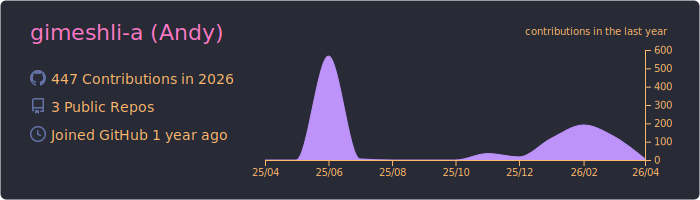
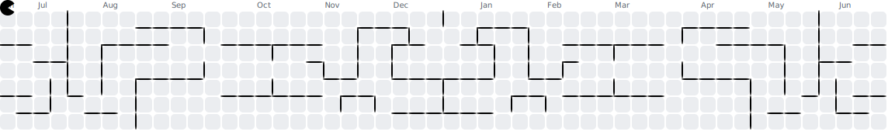

<h1 align="center">
  
</h1>

  
  <b>Bug Hunter</b>
  &nbsp;&nbsp;
  
  &nbsp;&nbsp;
  

###
---

  <!-- Languages & Core -->
  
  
  <!-- Testing Tools -->
  
  
  <!-- Infrastructure & DB -->
  
  
  <!-- Databases -->
  
  
  <!-- Dev & Design -->
  

###
---
<table align="center">
  <tr>
    <td align="center" style="border: none;">
      
    </td>
    <td align="center" style="border: none;">
      
    </td>
  </tr>
</table>

  

###
---
<picture>
  <source media="(prefers-color-scheme: dark)" srcset="assets/pacman-contribution-graph-dark.svg">
  <source media="(prefers-color-scheme: light)" srcset="assets/pacman-contribution-graph.svg">
  
</picture>

###
---

  
  
  
  

  

  

